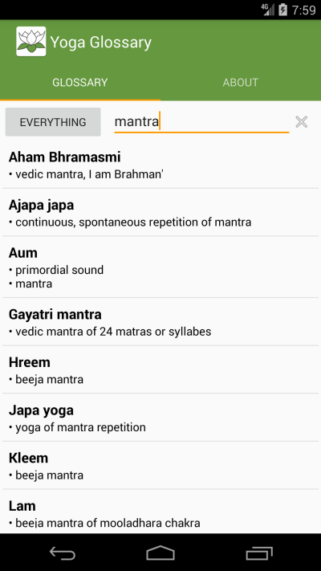

# yoga-glossary-android

- an open source Yoga Glossary for an android device
- The glossary source (terms, definitions) is in the [yoga-glossary](https://github.com/padmasambhava/yoga-glossary) project
- A **PadmaSamShava** project [padma.org.uk](http://www.padma.org.uk/)

